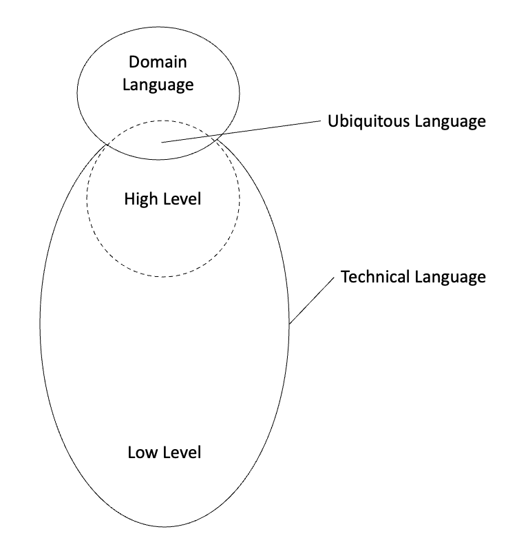
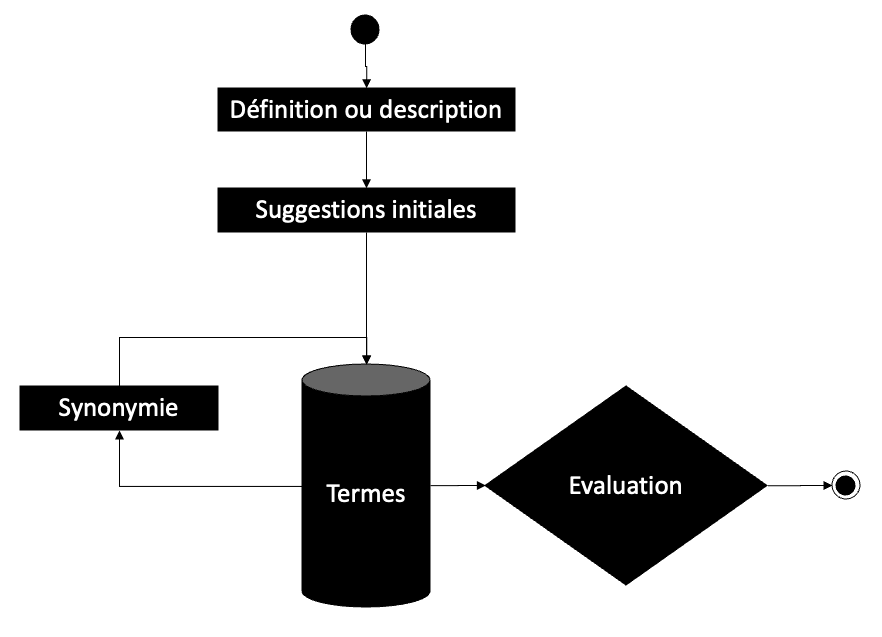
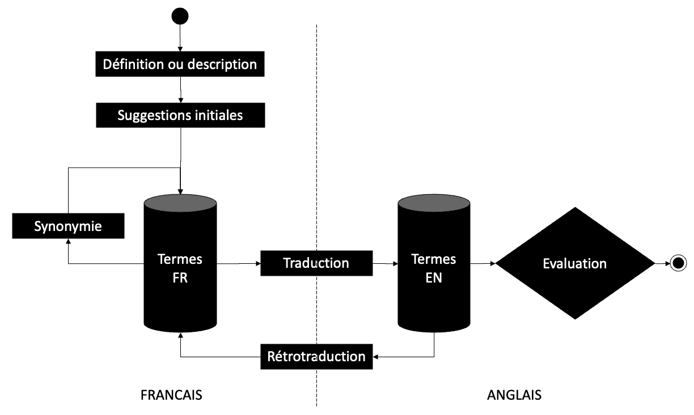

# Un mot sur la conceptualisation

*Pourquoi, quand et comment être efficace lors du nommage*

Le nommage est souvent présenté comme l'une des choses les plus difficile du développement logiciel. 

Le client - ou celui qui exprime le besoin - communique dans sa langue une demande d'automatisation. Une partie du vocabulaire est utilisé dans le code. C'est le fameux "langage ubiquiste" [^10]. 

Ce vocabulaire initial est très souvent incomplet. D'une part, le client n'a pas toujours conscience de la complexité qui se cache derrière sa demande et de la nécessité d'introduire de nouveaux concepts. D'autre part, il faudra créer certaines abstractions dans le code et donc proposer de nouveaux termes.

En général, cette activité est plaisante. Il y a en effet quelque chose de très créatif à révéler une idée qui était cachée. Mais c'est aussi une activité assez intense, avec parfois plusieurs heures passées à tâtonner. 

Cela m'a amené à me demander : ce temps passé est-il vraiment nécessaire dans tous les cas ? Est ce qu'il est possible d'optimiser cette recherche et de trouver efficacement le bon terme ?

### Lisibilité et enjeux

Mais avant, quelques rappels.

Une très grande partie du temps de développement est consacré à lire du code [^20] [^30]. Les 2 tiers du code sont constitués par des termes [^40]. Autrement dit, une grande majorité du temps est passée à lire des termes. 

Trouver les bons termes est donc faire preuve d'empathie pour tous les lecteurs du code. C'est même ainsi qu'est rendu possible le travail en équipe. 

Même en étant seul, quelques années (ou quelques mois...) suffisent à être étranger à son propre code. Or, la maintenance d'un projet représente généralement 70% du cout total du projet [^5]. 

Certaines études essayent de creuser d'avantage cette notion de lisibilité en l'associant à la notion de charge cognitive. Il devient alors possible de quantifier une amélioration ou une détérioration de lisibilité en mesurant l'activité cérébrale ou la précision et le temps de réponse à des tests de compréhension de code [^60] [^61]. 

Quelles que soient les méthodes utilisées, il parait imprudent de ne pas tenir compte de la lisibilité et du nommage tant les études convergent [^70].

### Homogénéité, syntaxe et langue

Pour améliorer le nommage, il existe de nombreuses recommandations de syntaxe. On y trouve par exemple des arbitrages entre camelCase et under_score (ou snake_case). 

Sur ce type de recommandation, très souvent, chacun a ses habitudes et les arguments ne sont pas décisifs. Théoriquement, les neurosciences peuvent aider à trancher des débats souvent stériles. Mais en pratique, c'est moins clair. Par exemple, une étude basée sur l'enregistrement du mouvement des yeux tend à conclure que la notation under_score demanderait moins d'effort en lecture mais serait plus imprécise que le camelCase [^80].

Une autre recommandation intéressante est l'idée de "moule", c'est-à-dire la manière dont les termes vont se combiner pour constituer un nom. Par exemple, la convention dite "big-endian" où une variable est suffixée par ordre d'importance [^90]. Le nombre maximum de commandes par mois serait donc *orders_per_month_max* plutôt que *max_orders_per_month*.

Cependant, dans toutes ces recommandations, **le plus important est l'homogénéité**. Si, pour certains, le camelCase est plus lisible que le snake_case, il est en revanche certain pour tout le monde que le mélange des deux sera plus dur à lire.

L'équipe doit donc se mettre d'accord sur un jeu de conventions qui sera appliqué dans un projet (et même des moyens d'en assurer le respect). Tout le monde gagnera en lecture et un nouveau contributeur aura plus de facilité à adopter ces conventions.

Dans le prolongement de l'idée d'homogénéité, il peut être **préférable d'utiliser des termes quasi-exclusivement anglais**, y compris pour un domaine métier qui serait dans une autre langue. Le travail de compréhension du code est déjà assez dur, inutile donc de mélanger deux langues. 

### Niveau d'abstraction et renommage

Il n'est pas toujours nécessaire de passer trop de temps à trouver un bon terme. En fait, **le temps investi devrait être proportionnel au niveau d'abstraction**. 



En effet, les caractéristiques d'un code de bas niveau d'abstraction font que l'impact d'un mauvais nommage est limité :
- Il est plus concret : donc souvent plus facile à nommer
- Il a une portée plus limitée, généralement encapsulé / couplage afférent plus bas : donc plus facile à renommer
- Il est plus rarement lu car lorsque nous lisons du code, nous ne rentrons pas dans tous les détails d'implémentation, nous restons le plus souvent assez haut dans l'abstraction avant de creuser : donc les termes choisis auront moins d'impact sur la lisibilité globale du projet
- Il faut passer par le code de haut niveau avant de le lire, tout ce qui est lu avant va donc aider à contextualiser, et donc le nommage est moins critique

Au contraire, l'effort de nommage doit donc se concentrer sur le haut niveau d'abstraction car :
- Beaucoup de termes seront forgés à partir de là
- Il peut être plus difficile de renommer tout un module que de renommer une variable dans une fonction de quelques lignes
- Il est possible que le terme soit directement utilisé dans une interface graphique et donc dans des traductions, ce qui augmente encore la difficulté de renommage
- Si le terme se retrouve dans le langage ubiquiste, il peut y avoir une certaine inertie d'usage par l'équipe ou le client

### Qu'est-ce qu'un terme ?

Déterminer efficacement le bon terme nécessite à ce stade de repréciser cette notion de "terme". 

Une recommandation assez consensuelle [^20] est d'utiliser des verbes pour les méthodes, et des noms communs pour les classes. Comme il s'agit de d'un concept, l'idéal serait que le terme :
- Ne soit pas composé de plusieurs mots car il y a de fortes chances que nous soyons obligés de l'associer à plusieurs autres termes (techniques ou non)
- Puisse se décliner en nom commun ou en verbe selon l'usage qui en sera fait
- Puisse se décliner facilement au pluriel 

En anglais, il est a priori plus simple de transformer un nom commun en verbe que l'inverse. C'est pour cette raison que la recherche d'un terme devrait plutôt être une recherche d'un nom commun.

- Shipping -> ship() : assez naturel
- Discount -> discount() : possible mais impossible de distinguer le nom du verbe
- Digital -> digitalize() ou digitize() : risque de confusion, ne portent pas le même sens
- Unicorn -> unicornize() : possible mais un peu forcé, pas très élégant

### Lister des candidats

L'écriture de tests et de code nécessitant beaucoup de ressources mentales, ce travail de conceptualisation devrait être une tâche à part.

Il existe des modèles de nommage, notamment celui de Feitelson [^100] vulgarisé par Felienne Hermans dans son livre [^110]. Voici ce qu'elle décrit sur le choix des termes:

> Often choosing the right words is straightforward, with one specific word being the obvious choice because it is used in the domain of the code or has been used across the codebase. However, in his experiments Feitelson observed that there were also **many cases in which for at least one of the words many different contending options were suggested by participants**. Such diversity can cause problems when developers become confused about whether synonyms mean the same thing or represent nuanced differences.

Une idée assez simple pour trouver les candidats est d'utiliser un dictionnaire de synonymes sur une ou plusieurs propositions initiales de noms communs. 



A noter qu'il est possible de partir directement de l'anglais mais aussi de la langue du métier. Dans ce cas, il est possible obtenir des suggestions par traduction et même par rétro traduction. L'objectif est d'arriver à une liste de propositions pertinentes en anglais. 



Par exemple :
- La description faite par le client : *contenu d'un camion de livraison (sable, fut d'huile, ou métaux à recycler par exemple)*
- Le client lui-même n'a pas de terme qui regroupe tout, il passe systématiquement par la désignation réelle, mais il devient nécessaire de créer ce concept dans le code
- Une suggestion initiale est *chargement*
- Quelques synonymes : *affrètement*, *charge*
- Les traductions donnent : *loading*, *freight*, *chartering*, *cargo*, *shipment*, *payload*

Natif anglais ou non, il faudra dans un premier temps se faire une idée précise des **nuances de sens**. Comme le dit Sean Glatch dans ses conseils d'écriture à destination des écrivains : 

> Finding the word that packs the most punch requires both a great vocabulary and a great understanding of the nuances in English. [^111]

En effet, les nuances de sens sont parfois subtiles : par exemple, quelles différences entre *Voucher*, *Coupon*, *Discount* ? 

Mais il existe d'autres critères que le sens.
 
### Évaluer le meilleur terme

Une approche intéressante pour l'évaluation du meilleur terme est de reprendre les **critères linguistiques** déjà énoncés et de les compléter. Il faut que le terme :
- Puisse se décliner en verbe (méthode) 
- Puisse se décliner au pluriel sans efforts de compréhension
- Comporte un nombre de lettres qui soit un compromis entre vitesse de compréhension [^120] et mémoire à court terme [^130], donc plus de 3 lettres (en fait, au moins une syllabe, ce qui rejoint aussi une recommandation que le terme soit prononçable) et moins de 20 lettres (arbitraire mais raisonnable ?)
- Utiliser des termes dans le registre courant (par opposition à soutenu ou vulgaire)
- Utiliser des termes qui ne soient pas trop équivoques, par exemple ne pas utiliser *Manager* ou *Data*, on parle en anglais de "weasel words" ("mot valise" en français ?) [^140]
- Ne pas utiliser de termes qui sont réservés au développement ou à l'infrastructure comme *Factory* ou *Container*

Pour aller encore un peu plus loin dans cette approche purement linguistique, il existe un concept intéressant appelé "hyperonymie" [^150]. Il s'agit tout simplement du terme linguistique pour désigner l'abstraction ! Un *animal* est l'hyperonyme d'un *lion*. Une *gazelle* est l'hyponyme d'un *animal*. L'ensemble des hyperonymes forme une taxonomie.

Ainsi, un **bon terme devrait être aussi un hyperonyme**, mais pas trop haut dans la taxonomie pour ne pas devenir trop générique non plus.

Par exemple, même s'il est difficile de généraliser, dans la taxonomie suivante *Transportation* > *Vehicle* > *Automobile* > *Car*, *Truck*, *Motorcycle* :
- *Transportation* est un peu trop vague, 
- *Vehicle* est un bon concept, 
- *Automobile* pourrait aussi faire l'affaire (mais quid d'un camion ?)
- *Car* est trop concret ou trop bas niveau

### Possibilité d'un glossaire neutre

Lister tous ces critères permet de faire le constat que **tous les mots du dictionnaire anglais ne sont pas de bons candidats**. 

En poussant cette réflexion plus loin, il devrait être possible de construire un grand glossaire qui soit neutre d'un point de vue du domaine métier et qui listerait les quelques milliers (?) de termes acceptables. Il n'y aurait plus qu'à piocher dans ce glossaire.

Cette idée est peut-être farfelue ou irréalisable ; il semble en tout cas que personne n'ait proposé la création d'un tel glossaire dans la littérature ou dans un projet ouvert. 

Mais même s'il était possible de construire ce glossaire, le problème est de **trouver un mot à partir d'un autre, ou à partir d'une définition**. Avoir la liste ne suffit donc pas à être efficace, il faudrait pouvoir aussi construire un dictionnaire de synonyme ou même un dictionnaire inversé.

Si seulement il existait un outil qui permette de saisir une description et d'obtenir une liste de propositions de mots... 

### Pertinence des LLM

Et oui, **un [LLM](https://en.wikipedia.org/wiki/Large_language_model) semble être l'outil idéal**. L'interaction avec un LLM est généralement sous la forme d'un agent conversationnel ou d'un prompt, ce qui correspond tout à fait au besoin. Et ces modèles sont intrinsèquement capables de trouver des liens entre les mots. 

Il suffit donc théoriquement de saisir une description initiale, les critères d'évaluation, et de demander une liste de propositions. 

Voici un exemple sans doute un peu naïf de prompt avec ces 3 paragraphes :

```
Humain > Je recherche un terme en anglais qui désigne le contenu d'un camion de livraison (sable, fut d'huile, ou métaux à recycler par exemple). 

Ce terme doit avoir les caractéristiques suivantes : un seul mot, nom commun, hyperonyme, de plus de 3 lettres, de moins de 20 lettres, du registre courant, qui ne soit pas considéré comme un "weasel word". 

Fais 5 propositions distinctes de termes triées par pertinence avec pour chacune le terme au singulier, au pluriel, quelques verbes anglais associés.
```

```
LLM > 
Cargo / Cargos / Load, Unload, Transport, Deliver
Goods / Goods / Transport, Ship, Deliver, Haul
Freight / Freights / Ship, Transport, Haul, Deliver
Load / Loads / Load, Unload, Transport, Carry
Shipment / Shipments / Ship, Receive, Transport, Deliver
```

```
Humain > Pourquoi pas "Payload" ?
```

```
LLM > "Payload" est un terme couramment utilisé pour désigner plutôt la charge utile transportée par un véhicule.
```

Il y a surement la possibilité d'améliorer le prompt car les résultats restent imparfaits :
- *Payload* : un bon candidat même si, en effet, souvent utilisé différemment 
- *Goods* : identique au pluriel et au singulier et beaucoup trop général
- *Load* : pas de différence avec le verbe et un peu trop connoté
- *Freight* : plutôt dans le domaine aérien ?
- *Shipment* comporte une intention d'expédition qui n'est pas pertinente ici
- Reste *Cargo* !

A noter qu'il est aussi possible de forcer le LLM à s'appuyer plutôt sur des données d'entrainement de type "codes sources". Le même prompt en remplaçant les critères linguistiques par des critères de bonne pratique de développement logiciel ("Ce terme doit respecter les bonnes pratiques de nommage dans le développement logiciel"). Mais les résultats semblent paradoxalement un peu moins bons.

Tout ceci reste à explorer...

### Conclusion

Finalement, le nommage reste difficile !

Pouvoir modifier le code sereinement permet d'atténuer les effets d'un mauvais nommage. Mais l'introduction de certains concepts doivent quand même faire l'objet d'une vraie réflexion en amont. 

Il existe quelques critères qui permettent d'être plus efficace à ce moment-là. Il est aussi possible que la solution soit un bon usage des LLM.

A ce sujet. Comme dans beaucoup d'autres métiers, l'émergence des LLM est une invitation à l'introspection, à la réflexion en profondeur du rôle d'un ingénieur logiciel :
- Certains proposent que les tests restent la prérogative des humains et que la machine s'occupe d'écrire le code de production ;
- D'autres soulignent que les LLM sont incapables d'écrire du code propre notamment parce que les LLM sont incapables de faire du Test Driven Development :"Writing tests is typically a task performed by human developers to ensure the correctness and robustness of their software." [^160]

Il y a encore quelques temps, je pensais que notre véritable rôle pourrait justement être de rendre lisible la complexité par le nommage et que notre imagination produirait de meilleurs résultats. Mais je n'en suis désormais plus si sûr... A moins d'écrire un logiciel extrêmement original, la plupart du temps nous cherchons à trouver des termes dont l'usage n'est pas confidentiel. Il parait donc légitime de demander à un LLM. Il peut être regrettable d'utiliser une langue ainsi appauvrie et consensuelle mais il faut probablement l'assumer dans ce cas.

**Finalement, qu'en pensez-vous ?** Le nommage doit-il être aussi compliqué ? Y a-t-il d'autres outils / process ? Faut-il utiliser les LLM pour cela ? Quels sont les meilleurs prompts ?

---

*Nommage, Concept, Abstraction, Ubiquitous language, Efficacité, Linguistique, LLM*

© 2023 - Antoine ROLLAND - licensed under [CC BY 4.0](http://creativecommons.org/licenses/by/4.0/?ref=chooser-v1)

[^10]: Eric Evans. Domain Driven Design: Tackling Complexity in the Heart of Software. 2003

[^20]: R. C. Martin. Clean Code, A Handbook of Agile Software Craftsmanship. 2011

[^30]: [Klaus Bayrhammer. You spend much more time reading code than writing code. 2020](https://bayrhammer-klaus.medium.com/you-spend-much-more-time-reading-code-than-writing-code-bc953376fe19)

[^40]: [F. Deißenböck and M. Pizka. Concise and consistent naming. 2005](https://itestra.com/wp-content/uploads/2018/03/06_itestra_concise_and_consistent_naming.pdf)

[^50]: B. Boehm and V. R. Basili. Software defect reduction top 10 list. 2001

[^60]: [Sarah Fakhoury, Yuzhan Ma, Venera Arnaoudova, and Olusola Adesope. The Effect of Poor Source Code Lexicon and Readability on Developers' Cognitive Load. 2018](https://doi.org/10.1145/3196321.3196347)

[^61]: [J. Siegmund, C. Kästner, S. Apel, C. Parnin, A. Bethmann, T. Leich, G. Saake, and A. Brechmann. Understanding source code with functional magnetic resonance imaging. 2014](https://kilthub.cmu.edu/articles/Understanding_Understanding_Source_Code_with_Functional_Magnetic_Resonance_Imaging/6626357/files/12123905.pdf)

[^70]: [Delano Oliveira, Reydne Bruno, Fernanda Madeiral†, Fernando Castor. Evaluating Code Readability and Legibility: An Examination of Human-centric Studies. 2021](https://arxiv.org/pdf/2110.00785.pdf)

[^80]: [Bonita Sharif and Jonathan I. Maletic. An Eye Tracking Study on camelCase and under_score Identifier Styles. 2010](https://www.researchgate.net/profile/Bonita-Sharif/publication/224159770_An_Eye_Tracking_Study_on_camelCase_and_under_score_Identifier_Styles/links/00b49534cc03bab22b000000/An-Eye-Tracking-Study-on-camelCase-and-under-score-Identifier-Styles.pdf)

[^90]: [HackerNews discussion around naming a very specific variable.](https://news.ycombinator.com/item?id=31436814)

[^100]: [Dror G. Feitelson Ayelet Mizrahi Nofar Noy Aviad Ben Shabat Or Eliyahu Roy Sheffer. How Developers Choose Names. 2021.](https://arxiv.org/pdf/2103.07487.pdf)

[^110]: Felienne Hermans. The Programmer's Brain. 2021

[^111]: [Sean Glatch. The importance of word choice in writing. 2022](https://writers.com/word-choice-in-writing)

[^120]: [J. C. Hofmeister, J. Siegmund, and D. V. Holt. Shorter Identifier Names Take Longer to Comprehend. 2019](https://www.infosun.fim.uni-passau.de/publications/docs/HoSeHo17.pdf)

[^130]: D. Binkley, D. Lawrie, S. Maex, and C. Morrell. Identifier length and limited programmer memory. 2009

[^140]: [Vladimir Khorikov. Ubiquitous Language and Naming. 2017](https://enterprisecraftsmanship.com/posts/ubiquitous-language-naming/)

[^150]: [Source Code Analysis and Natural Language Laboratory. Identifier Naming Structure Catalogue. 2022](https://github.com/SCANL/identifier_name_structure_catalogue#linguistic-antipatterns)

[^160]: [Jake Ogden. Job market risk assessment: clean code vs. AI code. 2023](https://cleancoders.com/blog/2023-10-29-Job-Market-Risk-Assessment-Clean-Code-vs-AI-Code)
